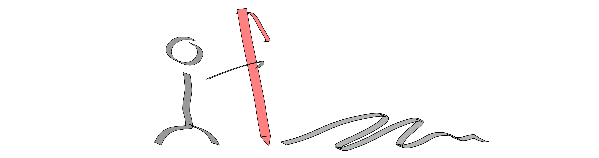

# Inkscape Figure Manager | A Neovim Plugin



Manage Inkscape figures with neovim. Inkscape is a cross-platform FOSS svg
editor great for drawing figures. The goal of this plugin is to create a
streamlined neovim and Inkscape workflow. This means creating, editing,
renaming, and exporting figures with minimal keystrokes.

## Installation

### Packer

Use the following snippet:

```lua
use({
  "silaswaxter/inkscape-figure-manager.nvim",
  ft = {"markdown"},
  rocks = {"inotify", "luaposix"}
})
```

## Features

- [x] create figure
- [x] edit figure
- [ ] rename figure
- [ ] explicitly watch figures

## Requirements

- Supported OS:
  - Linux

## FAQ

- What does it mean to "watch" figures, and why is this a feature?
  - To "watch" a figure means that a background process is looking at the
    figure files; when a figure is written, it can be exported. This behavior
    is a relic of Gille Castel's
    [work](https://castel.dev/post/lecture-notes-2/) of which this project was
    originally based--this plugin used to use a python back-end which was a fork
    of his work). Since most modern markdown renderers support `svg` images, this
    features is somewhat unnecessary; it does, however, allow the possibility of
    this plugin supporting LaTex in the future.
